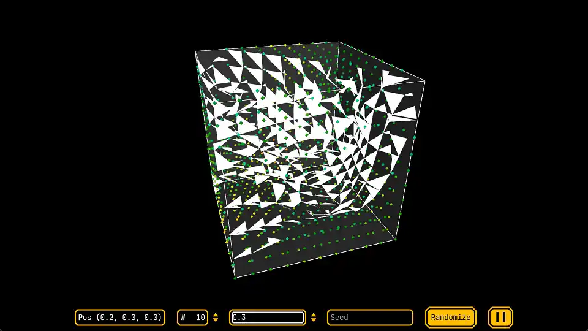
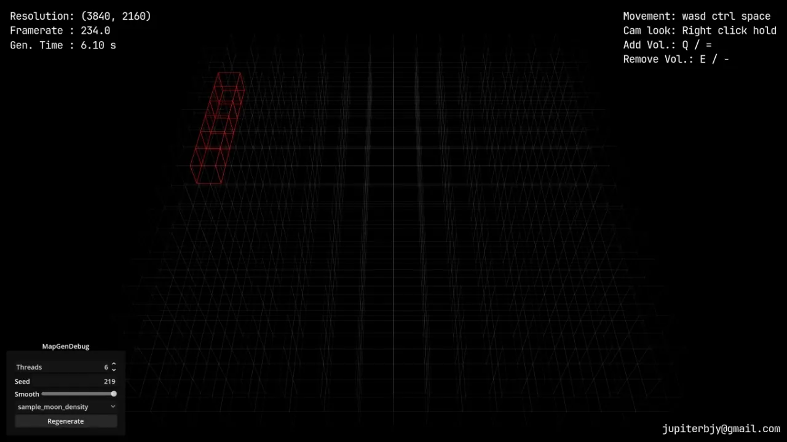
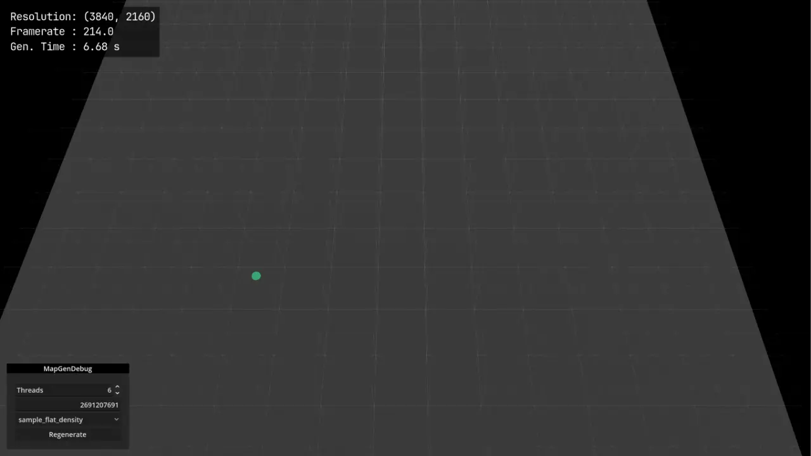
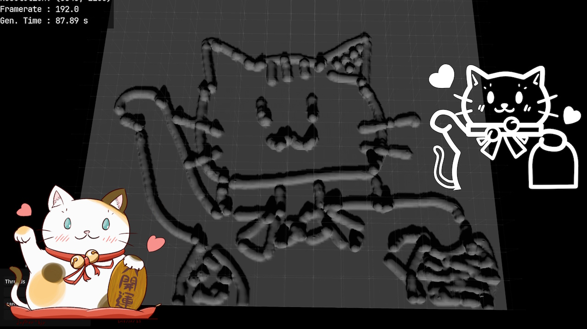
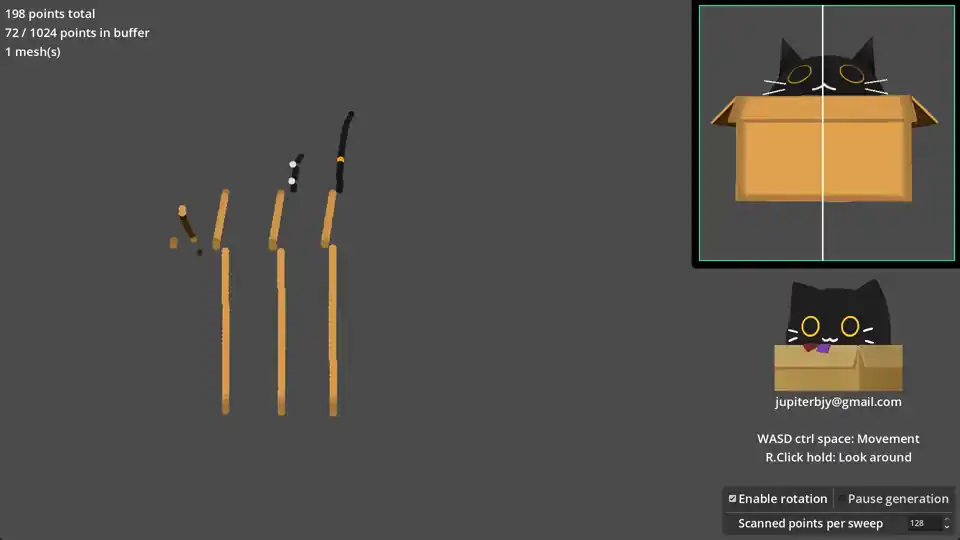
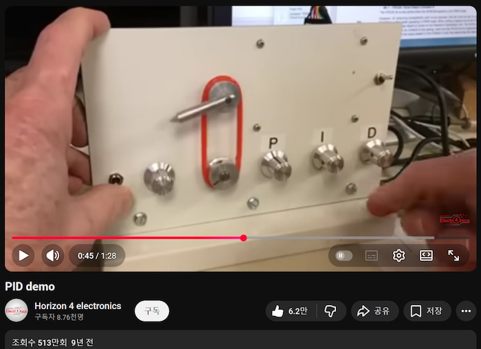
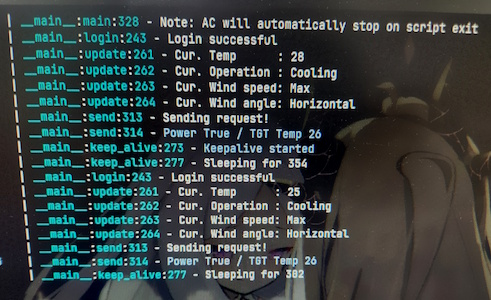
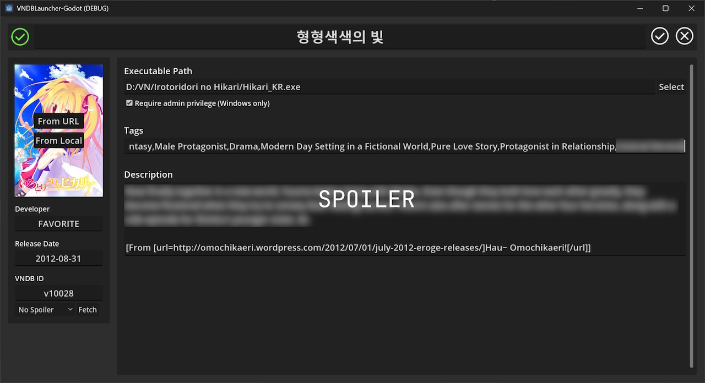
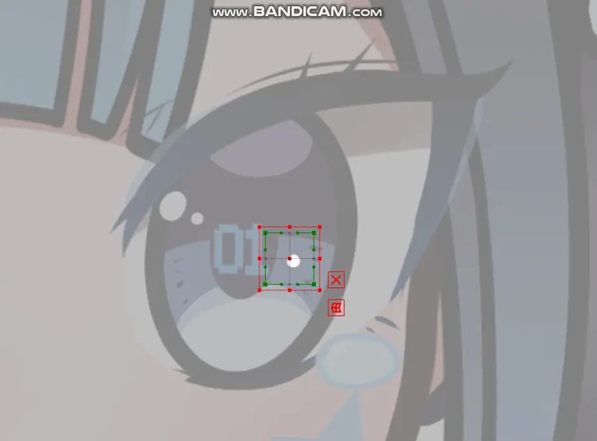

<!-- HEADER
title: Coding Projects (KR)
date: 2026-01-25 04:08:06 +0900
layout: post
-->

# Open Source Coding Projects (KR)

TODO: Add English ver

<sub>(주: 이미지가 불러와 지는데 시간이 다소 걸릴 수 있음)</sub>

대부분 취미로 만든 오픈소스 프로젝트들 중 일부.

<br>

### OpenAT (2023~2024)

| [레포지토리](https://github.com/jupiterbjy/OpenAT) | [유투브 트레일러](https://youtu.be/5v0qzULyCdM) | [유투브 시연](https://youtu.be/yI4WvkttvIA) | [역설계 문서](https://github.com/jupiterbjy/OpenAT/tree/main/Decoded) | [발표자료](https://drive.google.com/drive/folders/1WQcMJA5YzZ8_gi37-i-Knj3gi0hoRehB?usp=sharing) |
|-|-|-|-|-|

|  |  |
|--------------------|--------------------|

<br>

1년 중 50일 단기로 교내 졸업프로젝트 대회 최우수상을 수상한 게임 리버스 엔지니어링 프로젝트.

친구와 같이 촉박한 시간 속에서도 끈기있게 게임의 쉐이더, 맵, 모델 및 폰트 포멧을 역설계,
복원하지 못한 부분들은그리거나 직접 모델링하였다.

여기에 기존 게임에 없던 모바일 터치 UI를 추가해 개발하였으며,
최종적으로 단상에서 최우수상과 30만원 상당의 상금을 수상할 수 있었다.

사용 도구:
- Godot Game Engine
- Python
- Blender
- `Paint.NET`
- ClipStudio Paint
- ffmpeg
- Davinci Resolve

<br>
<br>
<br>

---

## Marching Cube (2024)

| [레포지토리](https://github.com/jupiterbjy/ProjectIncubator-Godot/tree/main/MarchingCube) | [유투브 시연](https://youtu.be/C5BxkcOymus) |
|-|-|

|  |  |
|-------------------|-------------------|

<br>

예전부터 땅을 파는 게임을 좋아했다. 이중에서도 특히 마인크래프트, 테라리아같은 복셀 기반 게임과 달리
훨씬 자유로운 지형 파괴를 자랑하는 Space Engineers 와 Deep Rock Galatic 의 절차적 지형 생성에 흥미가 많아
이를 한번 구현해 보고 싶었다.

Dual Contouring, Marching Tetrahedron 등 여러 알고리즘이 있지만, 출퇴근에 소요되는 시간이 적지 않아
여유시간이 부족했기 때문에, 상대적으로 가장 공부하기 쉬운 Marching Cube를 구현하였다.

사용 도구:
- Godot Game Engine
- Blender

<br>
<br>
<br>

---

### Marching Cube Chunked & Threaded (2024~)

| [레포지토리](https://github.com/jupiterbjy/ProjectIncubator-Godot/tree/main/MarchingCubeChunked) | [웹 시연](https://jupiterbjy.github.io/ProjectIncubator-Godot/MarchingCubeChunked/build/) (새로고침 필요) | [유투브 시연](https://youtu.be/ou6bHSG7Um8) |
|-|-|-|

|  |  |
|----------------------|----------------------|
|   |   |

<br>

앞서 구현한 알고리즘도 마치 화면보호기 처럼 구경하는 맛이 좋았지만,
궁극적으로 이를 게임에 적용하기 위해서는 먼저 청크와 멀티스레딩 구현이 필요했다.

하지만 고도 엔진의 구현상 버그로 mutex 등의 락 없이는 분명 불변 상수값임에도
여러 스레드가 동시에 읽을 때 낮은 확률로 쓰레기 값을 읽어오는 버그가 존재한다.
때문에 최적화를 유지하면서도 이를 우회하기 위한 갖은 노력 끝에 구현해 낼 수 있었다.

여기에 좀더 성능 친화적인 지형 상호작용을 구현, 나름대로 그림을 그릴 수준까지의 속도에 도달하였으며,
이를 기반으로 자원을 캐는 컨셉의 RTS 게임을 한번 만들어 볼 계획이다.

사용 도구:
- Godot Game Engine
- Blender


<br>
<br>
<br>

---

### Pointcloud(2024)

| [레포지토리](https://github.com/jupiterbjy/ProjectIncubator-Godot/tree/main/PointCloud) | [웹 시연](https://jupiterbjy.github.io/ProjectIncubator-Godot/PointCloud/build/) | [유투브 시연](https://youtu.be/i7JjA6DPJi0) |
|-|-|-|



<br>

포인트 클라우드는 말 그대로 점의 구름으로, 주로 두가지 경로를 통해 입수되는데

1. LiDAR 등의 레이저 스캐너를 이용한 장비들. 이 경우 색깔 획득을 위한 카메라가 복합적으로 추가되기도 함.

2. Photogrammetry. 다양한 각도에서 대상을 찍은 사진의 GPS와 자세정보 데이터를 이용,
삼변측량(Trilateration)을 통해 각 픽셀 위치 결정

관련 업무를 하다보니 점들이 모이며 점점 형상이 채워져 가는 모습에 묘한 만족감을 느껴,
이 느낌을 남들도 쉽게 체험해 볼 수 있도록 제작하였다.

3D 모델에 레이캐스팅 하는 방식으로 LiDAR 스캔을 흉내내어 포인트 클라우드 획득,
메시 구성 후 쉐이더를 통해 렌더링하는 과정을 구현했고,
아무 특색없는 원기둥같은걸 스캔하면 재미가 없기 때문에 간단한 고양이 모델을 심심풀이로 제작해 넣었다.

사용 도구:
- Godot Game Engine
- Blender
- `Paint.NET`

<br>
<br>
<br>

---

### PID Tuner (2025)

| [레포지토리](https://github.com/jupiterbjy/ProjectIncubator-Godot/tree/main/PID#pid-demo) | [웹 시연](https://jupiterbjy.github.io/ProjectIncubator-Godot/PID/build/) | [유투브 시연](https://youtu.be/-tZ0Dy-3xao) |
|-|-|-|

|  |  |
|-----------------|----------------|

<br>

유투브에 조회수 500만짜리 오래된 영상이 하나 있다. ([링크](https://youtu.be/qKy98Cbcltw)) PID 에 대해 검색하면 최상단에 나오는데, 말 한마디 없이 단 90초만에 PID 의 기초를 눈으로 보여주는 훌륭한 영상이다.

이에 감명받아 직접 가지고 놀기 위해 해당 장치를 소프트웨어적으로 모사한 것으로, 이를 개발하며 흔히 알려진 PID 개념은 '순수' PID에 해당하고, 실제 사용하려면 I(Integral) 팩터에 여러 제어식을 붙여야 한다는 것을 배울 수 있었다.

사용 도구:
- Godot Game Engine
- `Paint.NET`

<br>
<br>
<br>

---

### PyTigris (2024)

| [레포지토리](https://github.com/jupiterbjy/PyTigris/blob/main/README.md) | [API 역설계 문서](https://github.com/jupiterbjy/pytigris/blob/main/API_MEMO.md) |
|-|-|

```python
import getpass
from datetime import datetime, timedelta

import pytz
import trio
# also support asyncio, trio is not installed by default

from pytigris import TigrisClient


async def _fetch_calendar():
    client = TigrisClient(
        input("Email: "),
        getpass.getpass("Password: "),
    )
    await client.login()
    
    end_date = datetime.now(pytz.timezone("Asia/Seoul"))
    start_date = end_date - timedelta(weeks=4)

    for event in await client.get_calendar(
        start_date=start_date,
        end_date=end_date,
    ):
        print(f"{event.title} - {event.start_datetime} - {event.end_datetime}")


trio.run(_fetch_calendar)
```

<br>

각 팀원들의 주간 상황을 추적하여 보고를 올려야 하는데, 휴가중인 인원이 근무중인 것으로 기록해두는 등 오류들을 확인하고 보고서를 작성하는 데 심하면 30분까지 소요되는 등 효율성 문제가 있었다.

때문에 인사 관리 사이트의 로그인 및 현황 달력 페이지를 틈틈이 뜯어보며 역설계해 비공식 API를 문서로 작성 후, 이를 구현하는 클라이언트를 개발해 코드상에서 정보를 얻어낼 수 있게 되었다.

이를 이용해 휴가, 날짜, 근무 시간을 파악하여 필요시 경고 후 보고서와 보고서에 첨부할 엑셀 시트를 작성해 주는 스크립트를 완성하였고, 덕분에 10\~30분씩 걸리던 보고 작업을 단 1\~5분으로 획기적으로 줄일 수 있었다.

사용 도구:
- Python
- Qwen2 14B (Ollama + OpenWebui, 역설계 문서 포매팅에 사용)


<br>
<br>
<br>

---

### Hongik AC API / DIY Wall Panel (2023)

| [레포지토리](https://github.com/jupiterbjy/HongikACPanel/blob/master/README.md) |
|-|

홍익대학교의 에어컨을 제어하기 위해 사이트를 역설계한 API 클라이언트 제작 및 이를 사용하는 월패드를 자작한 프로젝트.

|  |  |
|----------------------|-----------------------|

<br>

당시 홍익대학교에서 각 동아리실의 에어컨/히터 자동 종료시간을 30분으로 매우 짧게 제한했고, 리모컨이 따로 없었기 때문에 30분마다 사이트에 로그인해서 온도를 조절하거나 다시 켜는 번거로움이 있었다.

이에 브라우저가 필요없는 라이브러리를 만들고자 제어용 사이트를 수일에 걸쳐 뜯어보고 실험한 결과, 비공식 제어 API 일부와 html 파싱을 통해 구현해낼 수 있었고 이를 CLI 스크립트로 약 반년 간 사용하였다.

이후 여러 어려움 끝에 리눅스 프레임버퍼와 evdev에 직접 입출력을 하는 저전력 특화 간소 비동기 UI 프레임워크를 구현, 이를 라즈베리 파이에 올려 간이 월패드로 사용할 수 있었다.

사용 도구:
- Python
- `Paint.NET`
- Raspberry Pi 1B+
- Waveshare LCD35 ([이슈 참조](https://github.com/goodtft/LCD-show/issues/337#issue-1687420097))

<br>
<br>
<br>

---

### VNDB Visual novel launcher (2025~)

| [레포지토리](https://github.com/jupiterbjy/GDVNLauncher) | [유투브 시연](https://youtu.be/t6HLsS1xTVg?list=PLmaqFP6jEVilsSr2wSDV2J_ygrFlqOG-5) |
|-|-|

|  |  |
|---------------------------|--------------------------|
|   |  |

<br>

게임 ESD중 스팀에는 누적 플레이 시간 기능이 있는데, 비-스팀 게임의 경우 이 기능이 제공되지 않는다.

때문에 기존 업무 시간 측정용으로 작성한 스크립트를 쓰다, 아예 VNDB라는 비주얼 노벨 데이터베이스 사이트의 계정과 연동되는 게임 런쳐를 만드는 것으로 스케일이 커졌다.

관리자 권한 프로그램의 실행 시간 측정, 고도 게임엔진에서 제공하지 않는 VNDB 클라이언트 및 비동기 리퀘스트 등의 구현 등 여러 어려움이 있었지만, 사용가능한 수준까지는 구현하는 데 성공해 현재도 몇몇 게임들의 시간 측정에 유용히 쓰고 있다.

사용 도구:
- Godot Game Engine
- Python
- sqlite
- Bash & Powershell
- [VNDB API](https://api.vndb.org/kana)

<br>
<br>
<br>

---

### SimpleLive2DViewer (2021~)

| [레포지토리](https://github.com/jupiterbjy/SimpleLive2dViewer) | [웹 시연](https://jupiterbjy.github.io/SimpleLive2dViewer/?https://cdn.jsdelivr.net/gh/jupiterbjy/Live2DPractice-Cyannyan/CyanSDLowRes/CyanSD.model3.json) |
|-|-|

<sub>(애플 기기에서 작동하지 않을 수도 있음; 모바일 사파리 브라우저의 고질적인 표준 미준수 문제로 추측)</sub>

|   |  |
|------------------------|-----------------------|
|  |                       |

<br>

Live2D 모델들을 볼수 있게 해주는 라이브러리와 사이트들은 많지만, 링크만으로 간편하게 폰, 컴퓨터를 가리지 않고 특정 모델을 시현하기엔 어려웠다.

마침 하술할 Live2D 모델을 시연할 수단이 필요해, 깃허브의 정적 웹 컨텐츠 호스트 기능을 이용, url을 파라미터로 받게 구현하였다. (`[HOST_URL]?[link_to_model_json]`)

사용 도구:
- Webstorm
- 순수 HTML / CSS / js


<br>
<br>
<br>

---

### Live2D Fanart (2021)

| [레포지토리](https://github.com/jupiterbjy/Live2DPractice-Cyannyan) | [웹 시연](https://jupiterbjy.github.io/SimpleLive2dViewer/?https://cdn.jsdelivr.net/gh/jupiterbjy/Live2DPractice-Cyannyan/CyanSDLowRes/CyanSD.model3.json) | [유투브 시연](https://youtu.be/ByN_9UUdmSQ) |
|-|-|-|

|  |  |
|------------------------|-------------------------------------------------|

|  |  |
|-----------------------|-----------------------|

한창 버추얼 유투버가 인기가 있던 시기였기 때문에, 흥미가 생겨 Cubism 학생용 라이센스를 구매, 이를 공부해 직접 그린 그림이 살아 움직이게 할 심산이였다.

튜토리얼도 얼마 없던 시기라 그림을 쪼개서 그리는 방식과 쪼개진 그림을 리깅하는 것에 매우 많은 어려움이 있었지만, 약 5일 밤샘 끝에 전부 완성해 낼 수 있었고, 이를 이용해 Paint.NET으로 편집해 디스코드 스티커까지 만들 수 있었다.

이후 경험을 살려 싼 가격에 커미션을 받아보았지만, 남의 그림을 직접 쪼개서 재창조해야 한다는 현실을 깨닫고, 해당 커미션 완료 후 다시는 손을 들이지 않았다.

사용 도구:
- Live2D Cubism 4
- Clipstudio Paint
- `Paint.NET`


<br>
<br>
<br>

---

### SingleScriptsTools (2019~)

| [레포지토리](https://github.com/jupiterbjy/ProjectIncubator/tree/main/SingleScriptTools#singlescript-tools) |
|-|

사용 도구:
- Python

서구권에는 "망치와 못" 이라는 관용구가 있는데, 여러 변종이 있지만 그중 하나는 '새로 망치를 산 사람에겐 모든 문제가 못으로 보인다' 라는 것이다.

마침 파이썬을 군대에서부터 책으로 공부하기 시작한 이례로, 컴퓨터를 쓰며 마주하는 자잘한 문제들을 파이썬으로 자동화 하려는 습관이 생겼다.

그렇게 일상을 살아가며 문제해결에 썼던 단일 스크립트들을 모아온 것으로, 그 특성상 대부분의 스크립트가 콘솔 로깅 외에 별도의 재미있는 출력은 없으나 일부 예시를 들면 다음과 같다.

현재 보고있는 이 사이트도 마크다운 테마 외 별도 의존성 없이 작성 / 빌드 과정 전체에 걸쳐, 심지어 테스트에 쓸 비동기 http 서버까지도
이러한 스크립트 여럿을 조합하여 제작되었다. ([시연](https://youtu.be/0wLc9-5g8gw))

|               |
|---------------------|
| 이미지 평행 결합 / 분리 스크립트 |

|           |  |
|----------------------------|----------------------------------------------|
| 각 프로젝트의 미디어를 나열하는 html 생성기 | 디스코드 파이썬 실행 명령어                              |

|                      |                                                                              |
|----------------------------------------|-----------------------------------------------------------------------------------------------|
| OpenCV를 이용한 이미지를 교육용 모듈 '터틀' 의 동작으로 변환 | 스팀 게임 녹화 추출기 ([유투브 시연](https://youtu.be/yncGTaGYWaM?list=PLmaqFP6jEVilsSr2wSDV2J_ygrFlqOG-5)) |
