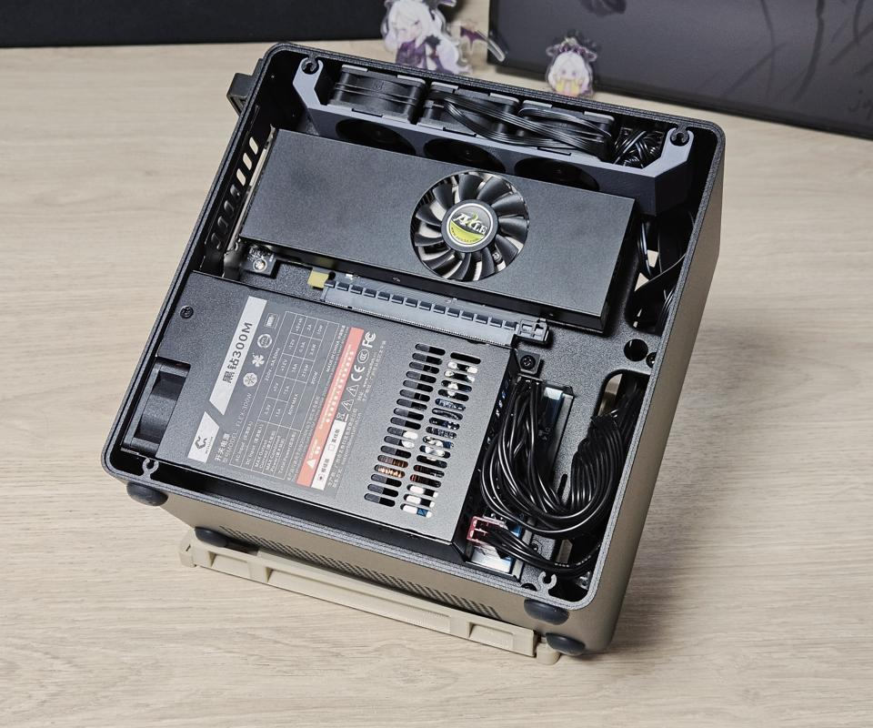
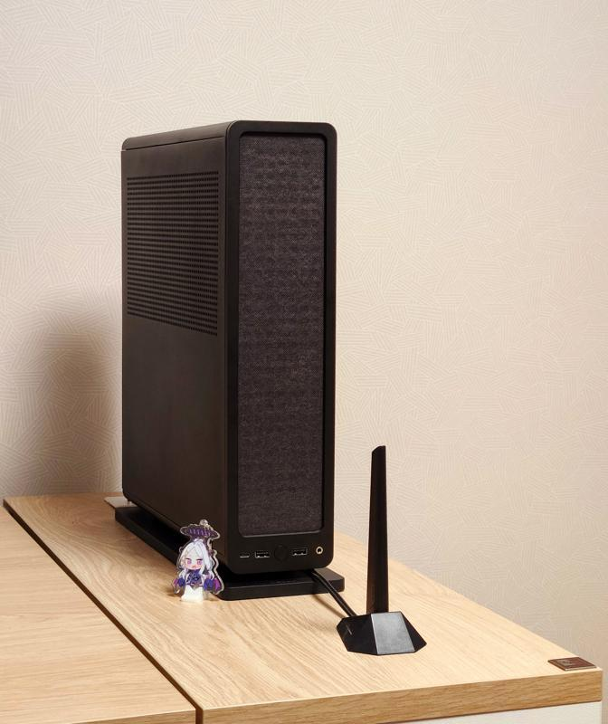
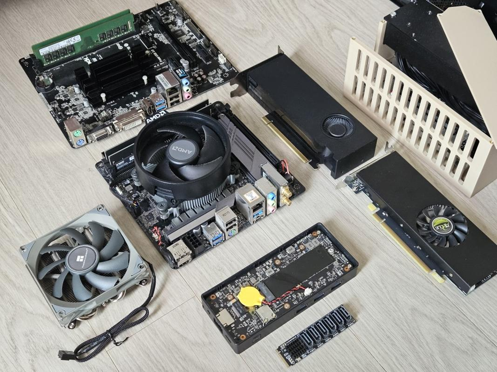
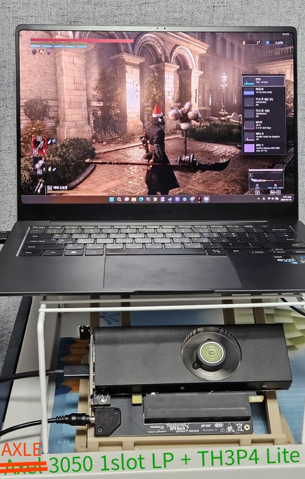
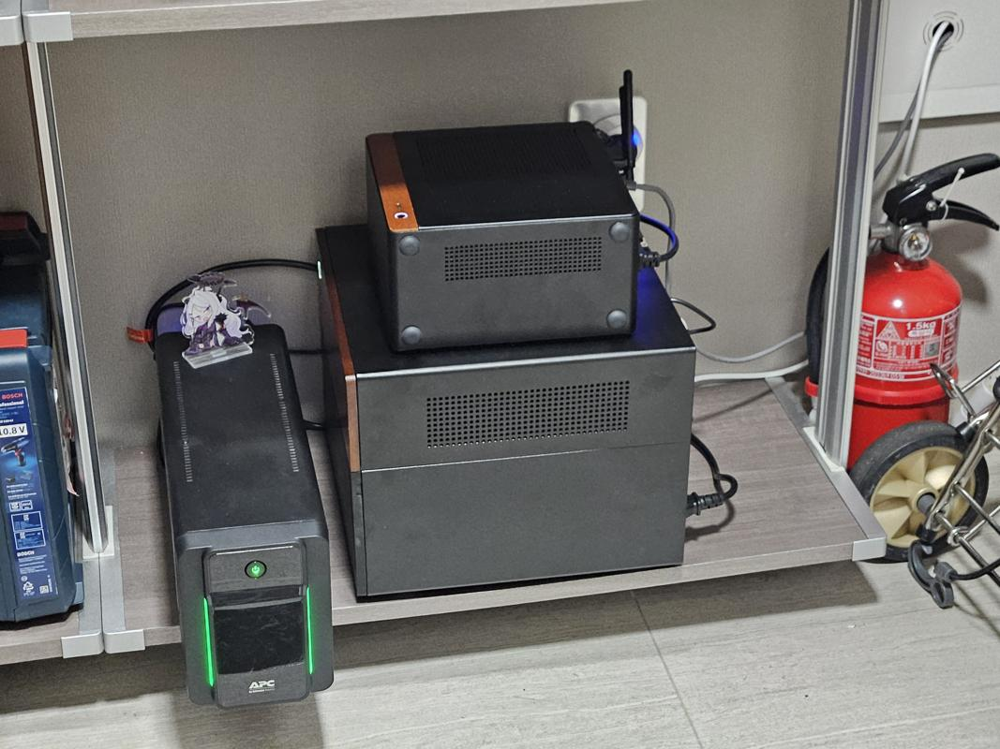
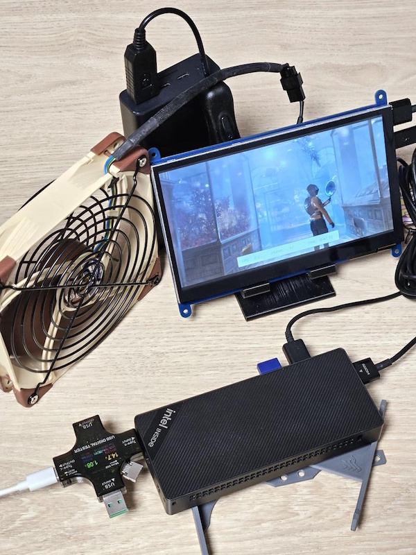
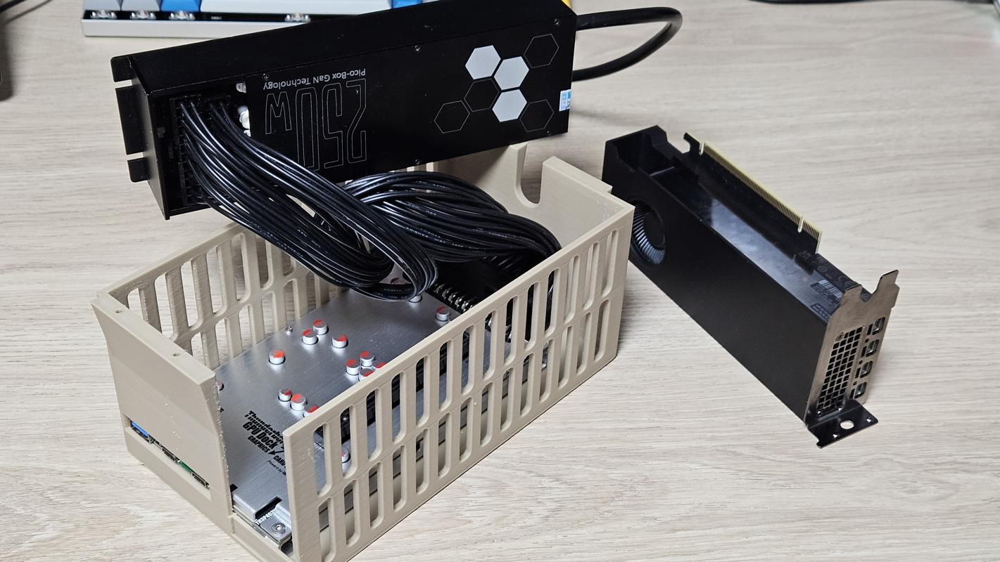

<!-- HEADER
title: PC Hardware Hobby
date: 2025-12-28 05:00:00 +0900
layout: post
-->

# PC Hardware Hobby

Built roughly 20+ PCs for others as semi-freelance hobby!

Designs & prints modification parts for cases, in pursuit for maximum airflow or for fun;
Hence major overlap exists with 3D printing hobby.

Usually active in reddit [r/sffpc](https://www.reddit.com/r/sffpc/).

- [ZFold-sized Mini PC](https://www.reddit.com/r/sffpc/comments/1dvb73m/this_pc_is_tiny)
- [Fractal Ridge 2x case fan mod](https://www.reddit.com/r/sffpc/comments/1d9f4np/60mm_25t_x2_fan_mount_for_fractal_ridge)
- [NV10 Build](https://www.reddit.com/r/sffpc/comments/1kv0vnj/some_average_nv10_build)
- [NV10 8x case fan mod](https://www.reddit.com/r/sffpc/comments/1pyor01/nv10_screwfree_8_case_fan_mod_update_10t_gpu_fan)
    - [youtube](https://youtu.be/e-bV_kkzYyQ)

|  |  |
|---------------------------------------|---------------------------------------|

|  |  |
|------------|------------|

|  |  |
|------------|--------------------------|

|  |  |
|---------------------------------------|---------------------------------------|

|  |  |
|--------------------------|---------------------------------------|

|  |  |
|------------|------------|

|  |  |
|--------------------------|--------------------------|

|  |  |
|--------------------------|---------------------------------------|

|  |  |
|---------------------------|-------------------|
