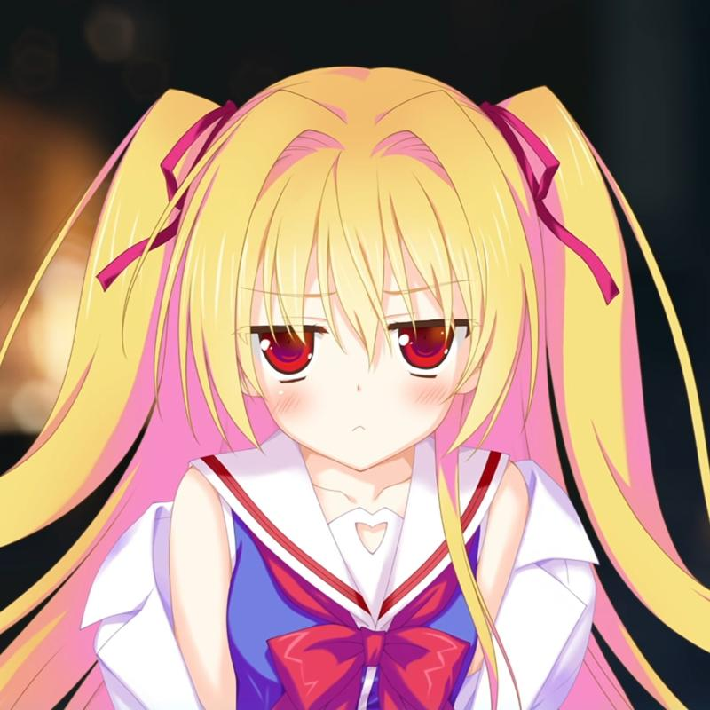

<!-- HEADER
title: In memory of Shinku
date: 2026-02-02 21:22:00 +0900
layout: post
-->

#### *In memories of the sorceress, Nikaidou Shinku*

|  |  |  |
|-|-|-|
|  |  |  |

<!--

-->

 
 

> _『 恋だよ、恋。私に出来なかったことのひとつを、君に代わりに叶えてもらう 』_  
> _『 Love. Romantic feelings. I want you to experience the one thing I was never able to. 』_  
> _『 사랑이야, 사랑. 내가 하지 못했던 것 중에서 하나를, 네가 대신 이루어줬으면 해 』_  

> _『 お前の明日が、今日よりも、ずっとずっと、楽しいことに溢れてるようにって、祈ってるよ 』_  
> _『 I hope that, your tomorrow is overflowing with more joy and fun than today ever was. 』_  
> _『 너의 내일이, 오늘보다도 훨씬 더 즐거운 일들로 넘쳐흐르기를, 바라고 있어 』_  

> _『 I hope that our tomorrow is overflowing with happy light, forever and ever...... 』_  
> _『 우리의 내일이 쭉, 언제까지나 쭉...... 행복한 빛으로 넘치기를, 나는 바랄게 』_

> _『 ......Sinners must be forgiven. They must not stop their effort to be forgiven. 』_  
> _『 ......죄인은 용서를 받아야만 해. 용서를 받기 위한 노력을 그만둬서는 안 돼 』_

> _『 If you've done something bad, and the worse it is, the first one you have to be forgiven by is "yourself". 』_  
> _『 어떤 나쁜 짓을 했다면, 그 나쁜 짓이 크면 클수록, 우선 가장 먼저 용서를 받아야만 하는건 "자기 자신" 한테라고 난 생각해 』_

<!--
> _『 ...If you can't forgive yourself, no one in this world will ever "forgive" you. 』_  
> _『 ......분명, 자신이 자신을 용서하지 못해선, 이 세계에선 아무도 "용서"를 해주지 않을거야 』_
-->

 

---

 

<iframe width="700" height="375" src="https://www.youtube.com/embed/goE8Xnwo0fI?si=ai0W-HB1s1T5vmsQ" title="YouTube video player" frameborder="0" allow="accelerometer; autoplay; clipboard-write; encrypted-media; gyroscope; picture-in-picture; web-share" allowfullscreen></iframe>

 
 

<iframe width="700" height="375" src="https://www.youtube.com/embed/rszdpU6Q6Wc?si=GrtF3VE2-pzCNjZB&amp" title="YouTube video player" frameborder="0" allow="accelerometer; autoplay; clipboard-write; encrypted-media; gyroscope; picture-in-picture; web-share" referrerpolicy="strict-origin-when-cross-origin" allowfullscreen></iframe>

 
 

    
MAJOR SPOILER WARNING

     
    <iframe width="700" height="375" src="https://www.youtube.com/embed/iSGqR_GyY94?si=XvbYiRRCzhI3MILt&amp" title="YouTube video player" frameborder="0" allow="accelerometer; autoplay; clipboard-write; encrypted-media; gyroscope; picture-in-picture; web-share" referrerpolicy="strict-origin-when-cross-origin" allowfullscreen></iframe>
     
     
    <iframe width="700" height="375" src="https://www.youtube.com/embed/eYYrQkTZK2g?si=BtcMr7DR6vCotPgx&amp" title="YouTube video player" frameborder="0" allow="accelerometer; autoplay; clipboard-write; encrypted-media; gyroscope; picture-in-picture; web-share" referrerpolicy="strict-origin-when-cross-origin" allowfullscreen></iframe>

